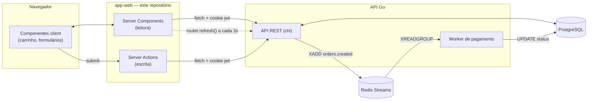

<div align="center">

# 🛍️ Meu E-commerce

**Frontend de um e-commerce protótipo full-stack**, construído em Next.js para consumir uma API em Go como Backend-for-Frontend — com contas por perfil, painel de vendedor e acompanhamento de pedido em tempo quase-real.


</div>

---

## 📸 Capturas de tela

<!--
  Espaço reservado — cole aqui os prints reais da aplicação rodando.
  Sugestão de arquivos, criando uma pasta `screenshots/` na raiz:

  screenshots/home.png        -> catálogo (visitante)
  screenshots/painel.png      -> painel do vendedor
  screenshots/pedido.png      -> timeline de acompanhamento do pedido

  E troque os comentários abaixo por:
  
  
  
-->

| Catálogo | Painel do vendedor | Acompanhamento do pedido |
|---|---|---|
| _adicione `screenshots/home.png`_ | _adicione `screenshots/painel.png`_ | _adicione `screenshots/pedido.png`_ |

---

## 📋 Sobre o projeto

Este repositório é o **frontend** de um e-commerce protótipo pensado para demonstrar, na prática, um backend em Go de verdade: autenticação por JWT, autorização por perfil, transação de estoque, fila assíncrona com Redis Streams e um worker processando pedidos.

O Next.js aqui atua como **BFF (Backend for Frontend)** — Server Components e Server Actions conversam diretamente com a API Go pelo servidor, o cliente nunca fala com o backend sem passar pelo Next.

A API que alimenta este frontend vive em [`turos22/APIRESTFull_GoLang`](https://github.com/turos22/APIRESTFull_GoLang).

## ✨ Funcionalidades

**Visitante**
- Catálogo de produtos (Server Component, busca direto na API)
- Carrinho persistido em `localStorage`, sincronizado entre abas

**Comprador**
- Cadastro e login com sessão via cookie `httpOnly`
- Checkout que cria o pedido de verdade na API (`POST /orders`)
- Lista dos próprios pedidos (`/meus-pedidos`)
- Tela de acompanhamento do pedido com timeline **pendente → pago → separando → enviado**, atualizando sozinha por polling enquanto o worker do backend processa o pagamento

**Vendedor**
- Painel com tabela do catálogo próprio
- Criar, editar e excluir produto (exclusão é *soft delete* no backend)
- Home invalidada automaticamente (`revalidatePath`) assim que um produto novo é criado

## 🏗️ Arquitetura



Duas decisões de arquitetura valem registro:

- **Sem middleware/proxy do Next para proteger rota.** Cada Server Component fechado chama um helper `exigirUsuario()` que confirma a sessão contra `GET /auth/me` de verdade — não é uma checagem otimista de cookie, é validação real a cada acesso.
- **Sem WebSocket para o status do pedido.** A tela de acompanhamento usa `router.refresh()` num intervalo, que refaz o Server Component e traz o status novo do servidor. Mais simples de operar, ao custo de alguns segundos de latência em vez de push instantâneo — troca deliberada para o escopo deste protótipo.

## 🛠️ Stack

| Camada | Tecnologia |
|---|---|
| Framework | Next.js 16 (App Router, Turbopack) |
| UI | React 19 + Tailwind CSS 4 |
| Linguagem | TypeScript 5 |
| Ícones | [`@tabler/icons-react`](https://tabler.io/icons) |
| Backend | Go + [chi](https://github.com/go-chi/chi) + [pgx](https://github.com/jackc/pgx) + [sqlc](https://sqlc.dev/) |
| Auth | JWT em cookie `httpOnly` ([`jwtauth`](https://github.com/go-chi/jwtauth)) |
| Banco | PostgreSQL |
| Fila | Redis Streams |

## 📁 Estrutura de pastas

```
app-web/
├── app/
│   ├── (auth)/          entrar, cadastrar, me
│   ├── (loja)/          home e carrinho
│   ├── painel/          CRUD de produtos do vendedor
│   ├── checkout/        finalização de compra
│   ├── meus-pedidos/    pedidos do comprador
│   └── pedido/[id]/     acompanhamento com timeline
├── components/
│   ├── auth/  carrinho/  checkout/  painel/  pedido/  produto/  template/
├── data/
│   ├── actions/         Server Actions (escrita)
│   ├── contexts/        sessão e carrinho, via React Context
│   ├── models/          tipos que espelham o contrato da API
│   ├── services/api.ts  toda chamada HTTP para o backend, num só lugar
│   └── utils/           formatação de moeda, proteção de rota
└── public/
```

## 🚀 Como rodar

Pré-requisitos: Node.js 20+ e a [API Go](https://github.com/turos22/APIRESTFull_GoLang) rodando localmente (Postgres + Redis via `docker compose`, ver README daquele repositório).

```bash
npm install

# aponte para onde a API estiver escutando
echo "API_URL=http://localhost:8080" > .env.local

npm run dev
```

Abra [http://localhost:3000](http://localhost:3000).

### Variáveis de ambiente

| Variável | Descrição | Padrão |
|---|---|---|
| `API_URL` | Base URL da API Go, usada só no servidor | `http://localhost:8080` |

## 🗺️ Rotas

| Rota | Acesso |
|---|---|
| `/` | pública |
| `/entrar`, `/cadastrar` | pública |
| `/carrinho` | pública |
| `/checkout` | logado |
| `/meus-pedidos`, `/pedido/[id]` | logado, dono do pedido |
| `/painel` | logado, perfil `vendedor` |
| `/me` | logado |

## 📌 Status do projeto

Protótipo em desenvolvimento ativo. Verificação de tipo e lint com `npx tsc --noEmit` e `npx eslint .`; ainda sem suíte de testes automatizados no frontend.

